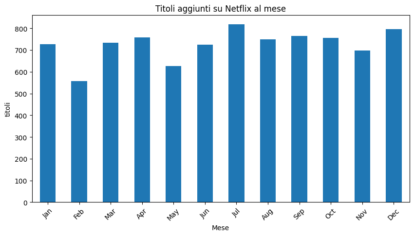
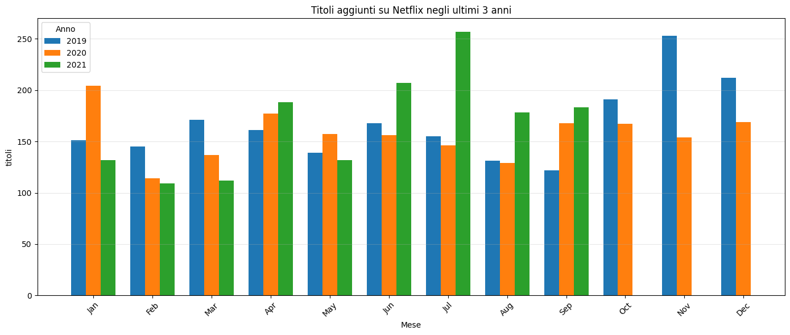
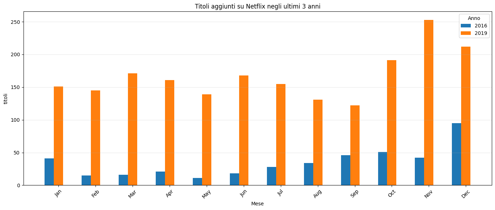

<h1><b> Analisi dettagliata del Dataset Netflix </b></h1>

<h3> Questo documento descrive le analisi condotte sul dataset dei titoli presenti su Netflix</h3>

<b><h2>1. Introduzione</h2></b>

Il dataset è stato preso da <a href="https://www.kaggle.com/datasets/shivamb/netflix-shows/data">Kaggle</a>,
esso contiene più di 8800 titoli presenti sulla piattaforma Netflix definendo, oltre al titolo, altre informazioni quali
la tipologia del titolo, il cast, il Paese e l'anno  di rilascio, l'anno di aggiunta sulla piattaforma, la valutazione e
la durata. Sul sito, il dataset viene aggiornato ogni mese, ma questa analisi prevede il file scaricato in data 30 settembre 2025.

<b><h2>2. Obiettivi</b></h2>

<b><h3>2.1 Analisi Temporale</b></h3>

Di seguito saranno effettuate delle analisi sulla distribuzione dei titoli in base all'annualità e alla mensilità per
comprendere in quale anno c'è stato un maggior numero di rilascio ipotizzando la motivazione e, nel caso mensile, comprendere
quale sia secondo la piattaforma, il periodo dell'anno migliore.

<b><h3>2.1.1 Distribuzione per anno di aggiunta</b></h3>

Per poter mettere mano sul dataset è stato necessario fare delle operazioni di preprocessing, in questo caso si è dovuto
mettere mano nella voce "date_added" del dataset per poter escludere eventuali voci senza una data e prendere in considerazione
solo l'anno, escludendo giorno e mese. 

Come si può vedere dal grafico, gli anni con un maggior numero di titoli caricati sulla piattaforma sono nel 2019 e 2020.
Molto probabilmente, se non sicuramente, questo numero è dovuto per la situazione della quarantena del COVID-19, dove visto
che si era costretti a rimanere a casa, la piattaforma ha pensato di caricare più titoli per avere più intrattenimento
durante quel periodo.

<b><h3>2.1.2 Distribuzione per mese (stagionalità)</b></h3>

<b><h4>2.1.2.1 Analisi della stagionalità generale</b></h4>

Prima dell'analisi ho pensato di fare una stima che prevedesse un maggior numero di titoli sotto il periodo natalizio(
quindi per la mensilità di dicembre) e per il periodo che comprende da aprile a luglio in quanto è un periodo in cui si nota
un numero maggiore di titoli in arrivo. Dopo questa stima, è stato preparata la tabella mostrata di seguito:

Dalla tabella si evince che il mese con maggiori titoli usciti è luglio. In seguito possiamo trovare come secondo mese con 
maggior numero di titoli dicembre. Per dicembre è risaputo che si punta nel portare nuovi film e serie TV inerenti al Natale.
Per quanto riguarda il mese di luglio probabilmente per il mercato è il periodo migliore anche se va in contrasto con l'idea dell'estate
dove le persone sono meno propense a stare a casa per guardare titoli sulla piattaforma.Mentre il mese con minor numero di titoli
è febbraio, ma questo forse è dovuto anche al fatto che sia il mese con il minor numero di giorni.

<b><h4>2.1.2.2 Analisi della stagionalità negli ultimi 3 anni</b></h4>

Per questa analisi mi limiterò a commentare solo i risultati ottenuti dalla tabella sottostante:

La prima cosa da notare è che, purtroppo, il dataset non è molto aggiornato, infatti per l'anno 2021 il dataset si ferma a 
settembre, facendo comprendere che in realtà questo dataset non è aggiornato mensilmente contrariamente da quando si è detto 
nell'introduzione ma è comunque interessante analizzare i dati che si hanno anche se non sono aggiornati all'ultimo anno.
Nel grafico non si rivelano picchi nel periodo di inizio COVID poiché i picchi che si possono notare sono a luglio 2021,
probabilmente dovuto ai motivi citati nella sezione precedente, mentre il secondo picco lo troviamo a novembre 2019 al quale
non ho collegamenti da fare anche perché nella sezione precedente il mese di novembre non presenta un picco, anche se ha comunque
un valore elevato.

<b><h4>2.1.2.3 Confronto stagionalità anno migliore vs. anno peggiore</b></h4>

Per questa analisi ovviamente scarteremo gli anni che non sono significativi (ovvero quelli fino al 2015) in quanto per questo
dataset si hanno solo 1 o 2 titoli aggiunti e quindi un numero non adatto per poter eseguire un confronto. Di conseguenza 
gli anni che saranno messi a confronto saranno quelli del 2016 e del 2019.

