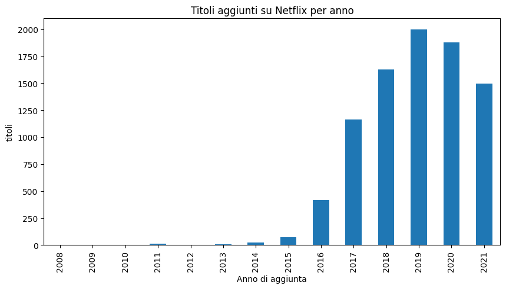

<h1><b> Analisi dettagliata del Dataset Netflix </b></h1>

<h3> Questo documento descrive le analisi condotte sul dataset dei titoli presenti su Netflix</h3>

<b><h2>1. Introduzione</h2></b>

Il dataset è stato preso da <a href="https://www.kaggle.com/datasets/shivamb/netflix-shows/data">Kaggle</a>,
esso contiene più di 8800 titoli presenti sulla piattaforma Netflix definendo, oltre al titolo, altre informazioni quali
la tipologia del titolo, il cast, il Paese e l'anno  di rilascio, l'anno di aggiunta sulla piattaforma, la valutazione e
la durata. Sul sito, il dataset viene aggiornato ogni mese, ma questa analisi prevede il file scaricato in data 30 settembre 2025.

<b><h2>2. Obiettivi</b></h2>

<b><h3>2.1 Analisi Temporale</b></h3>

Di seguito saranno effettuate delle analisi sulla distribuzione dei titoli in base all'annualità e alla mensilità per
comprendere in quale anno c'è stato un maggior numero di rilascio ipotizzando la motivazione e, nel caso mensile, comprendere
quale sia secondo la piattaforma, il periodo dell'anno migliore.

<b><h3>2.1.1 Distribuzione per anno di aggiunta</b></h3>

Per poter mettere mano sul dataset è stato necessario fare delle operazioni di preprocessing, in questo caso si è dovuto
mettere mano nella voce "date_added" del dataset per poter escludere eventuali voci senza una data e prendere in considerazione
solo l'anno, escludendo giorno e mese. 

Come si può vedere dal grafico, gli anni con un maggior numero di titoli caricati sulla piattaforma sono nel 2019 e 2020.
Molto probabilmente, se non sicuramente, questo numero è dovuto per la situazione della quarantena del COVID-19, dove visto
che si era costretti a rimanere a casa, la piattaforma ha pensato di caricare più titoli per avere più intrattenimento
durante quel periodo.

<b><h3>2.1.2 Distribuzione per mese (stagionalità)</b></h3>

